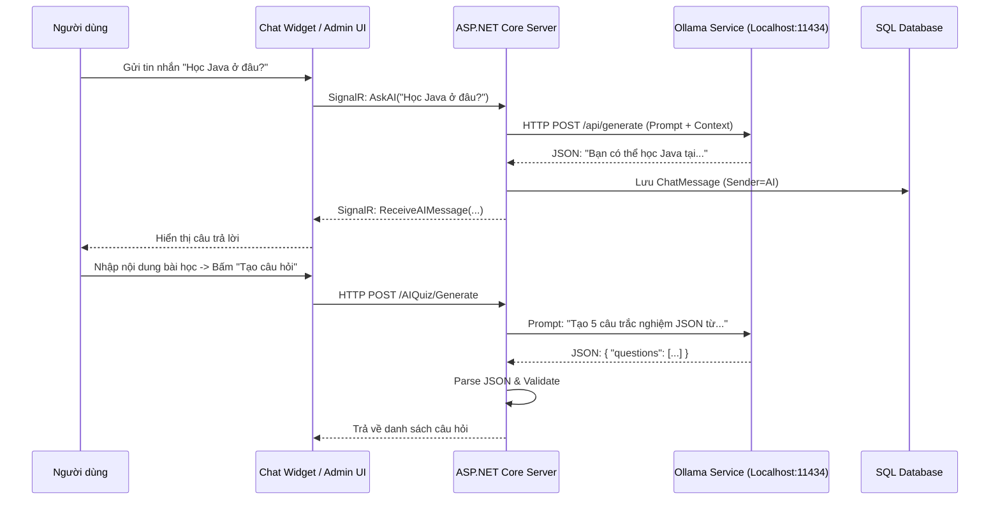

# Tài liệu Tích hợp AI với Ollama và ASP.NET Core

## 1. Kiến trúc Hệ thống (Architecture)

Hệ thống sử dụng kiến trúc **Local LLM** (Large Language Model chạy cục bộ) thông qua **Ollama**, tích hợp vào ứng dụng ASP.NET Core.

### Sơ đồ hoạt động


---

## 2. Các Thành phần Chính

### A. Ollama (AI Engine)
- **Vai trò**: Chạy mô hình ngôn ngữ (Llama 3.2, Gemma 2, etc.) để xử lý ngôn ngữ tự nhiên.
- **Giao tiếp**: Qua REST API tại `http://localhost:11434`.
- **Model**: Sử dụng `llama3.2` (hoặc `gemma2`) lightweight, phù hợp chạy trên máy cá nhân/server nhỏ.

### B. OllamaService (`Services/OllamaService.cs`)
Đây là lớp trung gian (Wrapper) để giao tiếp với Ollama.
- **Hàm `GenerateResponseAsync`**: Dùng cho Chatbot. Gửi prompt kèm "System Prompt" định nghĩa nhân cách là trợ lý giáo dục.
- **Hàm `GenerateQuestionsAsync`**: Dùng cho Quiz. Gửi prompt yêu cầu AI trả về định dạng **JSON** chuẩn để code có thể đọc được.

### C. ChatHub (`Hubs/ChatHub.cs`) - Real-time Chat
Sử dụng **SignalR** để tạo trải nghiệm chat mượt mà.
- **`AskAI` method**:
  1. Nhận câu hỏi từ Client.
  2. Gửi tín hiệu `AITyping` (đang nhập...) để UI hiển thị animation.
  3. Gọi `OllamaService` lấy câu trả lời.
  4. Lưu tin nhắn vào DB (với `SenderValidName = "AI Assistant"`).
  5. Gửi câu trả lời về lại Client.

### D. AIQuizController (`Controllers/Admin/AIQuizController.cs`)
Xử lý logic tạo đề thi.
- **Prompt Engineering**: Kỹ thuật quan trọng nhất ở đây là ép AI trả về đúng định dạng JSON.
- **Code mẫu prompt**:
  > "Bạn là giáo viên. Tạo 5 câu hỏi từ nội dung sau. Trả về JSON format: { "questions": [...] }. KHÔNG trả về text thừa."

---

## 3. Quy trình Xử lý Dữ liệu

### Trong Chatbot
1. **Input**: Câu hỏi thô của user.
2. **Context Injection**: Code sẽ chèn thêm thông tin ngữ cảnh vào đầu prompt:
   > "Bạn là trợ lý ảo của Symphony Academy. Hãy trả lời ngắn gọn, thân thiện bằng tiếng Việt..."
3. **Output**: Text trả lời tự nhiên.

### Trong Quiz Generator
1. **Input**: Nội dung bài học (text dài) + Số câu hỏi + Độ khó.
2. **Processing**:
   - Gọi AI với prompt yêu cầu cấu trúc JSON.
   - AI trả về string chứa JSON.
   - Code C# dùng `JsonSerializer` để parse string đó thành object `GeneratedQuestion`.
   - Nếu AI trả về lỗi hoặc format sai, code sẽ `try-catch` và thử lại hoặc báo lỗi.

---

## 4. Tùy biến và Mở rộng

### Thay đổi Model
Bạn có thể thay đổi model AI trong `appsettings.json`:
```json
"Ollama": {
  "BaseUrl": "http://localhost:11434",
  "Model": "gemma2" // Hoặc "mistral", "llama3"
}
```

### Fine-tuning (Nâng cao)
Hiện tại hệ thống dùng **Prompt Engineering** (hướng dẫn AI qua prompt). Để thông minh hơn, bạn có thể:
1. **RAG (Retrieval-Augmented Generation)**: Trước khi gửi câu hỏi cho AI, tìm kiếm các khóa học/thông tin liên quan trong Database, kẹp vào prompt để AI trả lời chính xác thông tin của trung tâm.
2. **Fine-tuning**: Huấn luyện riêng model với dữ liệu của Symphony Academy.

---

## 5. Kết luận
Giải pháp này kết hợp sức mạnh của **Generative AI** hiện đại với sự ổn định của **ASP.NET Core**.
- **Ưu điểm**: Riêng tư (chạy local), Không tốn phí API (OpenAI/Google), Tùy biến cao.
- **Nhược điểm**: Phụ thuộc cấu hình phần cứng server (RAM/GPU) để chạy model nhanh.
