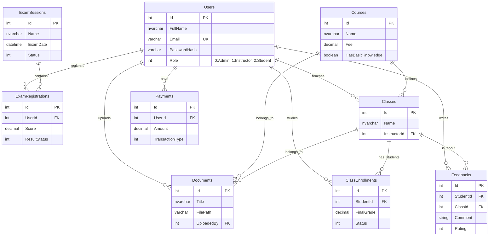

# Thiết Kế Cơ Sở Dữ Liệu Chi Tiết (Database Design)

Tài liệu này chứa toàn bộ thiết kế về CSDL: Sơ đồ ERD, Danh sách bảng, và Đặc tả chi tiết từng cột.

## 1. Sơ đồ Quan hệ Thực thể (ERD - Mermaid)

---

## 2. Đặc tả Chi tiết Schema (Data Dictionary)

### 2.1. Nhóm Core (Users)
*   **Users**: Quản lý tài khoản (Admin, Instructor, Student).

### 2.2. Nhóm Đào tạo (Academic)
*   **Courses**: Danh mục khóa học (Tên, Học phí, Mô tả).
*   **ExamSessions**: Kỳ thi tuyển sinh (Ngày thi, Lệ phí, Hạn đăng ký).
*   **ExamRegistrations**: Hồ sơ đăng ký thi của thí sinh (Điểm thi, Kết quả đậu/rớt).

### 2.3. Nhóm Lớp học (Classes)
*   **Classes**: Lớp học thực tế (Giảng viên, Lịch học, Phòng học).
*   **ClassEnrollments**: Học viên trong lớp (Điểm số, Trạng thái học).
*   **Documents**: (**Mới**) Tài liệu học tập.
    *   `Id`: PK.
    *   `Title`: Tên tài liệu.
    *   `FilePath`: Đường dẫn file.
    *   `Type`: Bài giảng/Bài tập.
    *   `CourseId` / `ClassId`: Tài liệu này thuộc về ai.
*   **Feedbacks**: (**Mới**) Đánh giá phản hồi.
    *   `Id`: PK.
    *   `StudentId`: Người đánh giá.
    *   `ClassId`: Lớp được đánh giá.
    *   `Content`: Nội dung.
    *   `Rating`: Số sao (1-5).

### 2.4. Nhóm Tài chính & Chung
*   **Payments**: Lịch sử giao dịch (Học phí, Phí thi).
*   **Branches**: Thông tin chi nhánh.
*   **Faqs**: Câu hỏi thường gặp.
