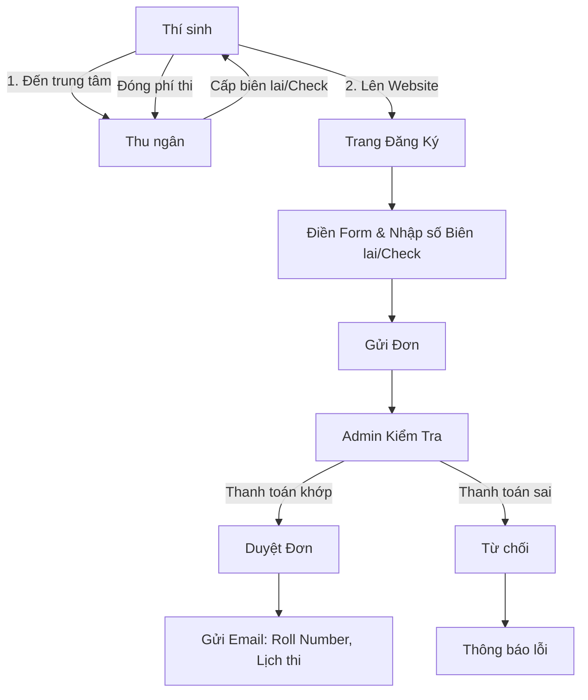
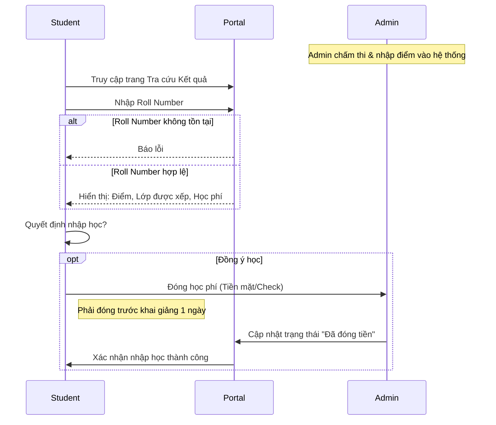
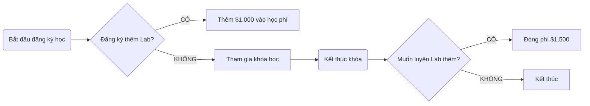

# SYMPHONY LIMITED - Phân Tích Chức Năng & Quy Trình Nghiệp Vụ

## 1. Giới Thiệu (Introduction)
Symphony Ltd. là học viện tư nhân đào tạo chứng chỉ CNTT (Networking, Java, Database...). Hệ thống Portal được xây dựng để thay thế quy trình quảng cáo và tuyển sinh thủ công hiện tại, giúp quản lý tập trung và hiệu quả hơn.

## 2. Các Tác Nhân (Actors)
1.  **Admin (Quản trị viên):** Quản lý toàn bộ nội dung, khóa học, kỳ thi, nhập điểm và xác nhận thanh toán.
2.  **User (Guest/Student):** Khách vãng lai tìm hiểu thông tin hoặc Học viên tham gia tuyển sinh, xem điểm.

---

## 3. Yêu Cầu Chức Năng (Functional Requirements)

Hệ thống được chia thành 2 phân hệ chính theo yêu cầu:

### 3.1. Phân hệ Người dùng Công khai (Normal Site Functionality)
Dành cho Guest và Student truy cập để xem thông tin và thực hiện quy trình tuyển sinh.

1.  **Trang Chủ (Home Page):**
    *   Hiển thị giới thiệu ngắn gọn về Viện.
    *   Hiển thị các khóa học mới, tin tức nổi bật.
2.  **Trang Giới Thiệu (About Us):**
    *   Thông tin chi tiết về lịch sử, sứ mệnh của Viện.
3.  **Chi Tiết Khóa Học (Course Details):**
    *   Danh sách các khóa học đang cung cấp.
    *   Chi tiết từng khóa: Chủ đề (Topics), thời lượng.
4.  **Tuyển Sinh & Thi Đầu Vào (Entrance Examination):**
    *   **Xem Lịch thi:** Xem thông tin các kỳ thi sắp tới (tổ chức 6 tháng/lần).
    *   **Xem Kết quả thi (View Results):**
        *   Nhập **Số báo danh (Roll Number)** để tra cứu.
        *   Hiển thị: Điểm số, Lớp được xếp (Cơ bản/Nâng cao), Học phí phải đóng, Hạn chót thanh toán.
        *   Nếu không tìm thấy Roll Number -> Thông báo lỗi.
    *   **Đăng ký Thi Online:**
        *   Điền form đăng ký.
        *   Nhập thông tin thanh toán (Số biên lai tiền mặt hoặc Số Check/DD).
5.  **Hỏi Đáp (FAQ's):** Các câu hỏi thường gặp về quy trình, học phí, giờ Lab.
6.  **Liên Hệ (Contact Us):** Danh sách địa chỉ các chi nhánh và số điện thoại.

### 3.2. Phân hệ Quản Trị (Admin Functionality)
Dành cho Admin đăng nhập để quản lý dữ liệu.

1.  **Quản Lý Khóa Học:**
    *   Thêm/Sửa/Xóa khóa học.
    *   Cập nhật danh sách chủ đề giảng dạy.
2.  **Quản Lý Kỳ Thi (Entrance Exam Management):**
    *   Tạo kỳ thi mới.
    *   Cập nhật lệ phí thi.
    *   Quản lý danh sách thí sinh đăng ký.
3.  **Quản Lý Kết Quả & Xếp Lớp (Result & Class Allocation):**
    *   Nhập dữ liệu thí sinh: Roll Number, Tên, Điểm thi.
    *   **Xếp lớp:** Dựa trên điểm thi, hệ thống/admin xếp thí sinh vào lớp phù hợp (Cơ bản hoặc Nâng cao).
    *   Nhập thông tin học phí tương ứng cho thí sinh đó.
4.  **Quản Lý Nội Dung (Content Management):**
    *   **About Us:** Cập nhật thông tin viện.
    *   **FAQ:** Thêm/Sửa câu hỏi thường gặp.
    *   **Admission Procedures:** Cập nhật hướng dẫn "How to join".
    *   **Contact/Centers:** Cập nhật danh sách chi nhánh, địa chỉ.
5.  **Quản Lý Tài Chính (Financials):**
    *   Thiết lập mức phí cho Khóa học và Kỳ thi (có thể thay đổi theo thời gian).

---

## 4. Quy Định Nghiệp Vụ & Tài Chính (Financial & Business Rules)

### 4.1. Phân Loại Khóa Học & Học Phí
Dựa trên kết quả thi đầu vào, học viên được xếp vào 2 loại lớp:

| Loại Lớp | Đối Tượng | Thời Gian | Học Phí |
| :--- | :--- | :--- | :--- |
| **Lớp Có Kiến Thức Nền (Advanced)** | Đạt điểm chuẩn bài test | 4 tháng | **$4,275** |
| **Lớp Chưa Có Kiến Thức (Basics)** | Điểm thấp / Người mới bắt đầu | 6 tháng | **$6,000** |

### 4.2. Phí Phòng Lab (Extra Lab Sessions)
Học viên được dùng Lab trong giờ học. Nếu muốn đăng ký thêm giờ Lab (Lab Practice):

*   **Thời điểm đăng ký:**
    1.  **Cùng lúc đăng ký khóa học:** Phí **$1,000**.
    2.  **Sau khi khóa học kết thúc:** Phí **$1,500**.
*   **Quy định:** Phòng Lab mở đến 9PM.

### 4.3. Quy định Thanh toán
*   **Phương thức:** Tiền mặt (tại quầy), Séc (Cheque), Hối phiếu (Demand Draft).
*   **Hạn chót:** Thanh toán học phí ít nhất **1 ngày trước khi khóa học bắt đầu**.

---

## 5. Quy Trình Nghiệp Vụ (Process Flows)

### 5.1. Quy trình Đăng ký Tuyển sinh (Entrance Exam Registration)

### 5.2. Quy trình Xem Kết Quả & Nhập Học

### 5.3. Quy trình Đăng ký Lab (Lab Session)

